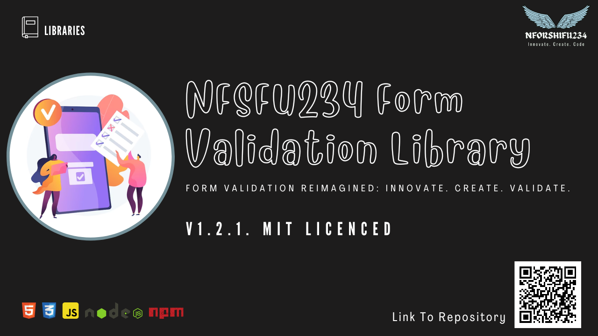

# 📜 NFSFU234 Form Validation Library

[](https://github.com/nforshifu234dev/nfsfu234-form-validation/blob/main/LICENSE)
[](https://www.npmjs.com/package/nfsfu234-form-validation)


 




### Table of Contents 📑
- [Description](#🚀-description)
- [Installation](#🛠️-installation)
  - [Using The CDN URL](#☁️-using-the-cdn-url)
  - [Install via npm](#⚙️-install-it-via-npm)
- [Usage](#🚀-usage)
  - [Browser Usage](#🚀-usage)
  - [Node.js Usage](#using-nfsf234-form-validation-library-in-nodejs-application)
- [Initialization](#🏁-initialization)
- [Available Functions](#📚-available-functions-in-nfsfu234-form-validation-library)
- [License](#license-📜)
- [Contributing](#contributing-🚀👋)
- [Credits](#credits-🙌)
- [Support](#support-🤝)

## 🚀 Description

Introducing the NFSFU234 Form Validation library – yes, it's my very first attempt at creating something useful for the coding world. This little JavaScript gem is all about making sure your HTML form elements play nice and follow the rules. 🎉👨‍💻

Now, I'm no expert, but I figured that validating forms could be a lot less painful. So, I cooked up NFSFU234 Form Validation. It's lightweight, beginner-friendly, and it's got a soft spot for textarea fields – those underappreciated champs. 📝🕶️

Look, I'm not promising to solve every validation puzzle out there, but I did manage to make things easier. You can customize error messages to sound as friendly or as stern as you like. And those mandatory fields? Yeah, I've got their back. ✅🔒

Oh, and if you're into stylish apps, NFSFU234 Form Validation offers ways to show errors that suit your app's vibe – whether it's neat little inline notes or those snazzy pop-up modals. 🎨💥

So, yeah, this is my debut library. I'm still learning the ropes, but I thought, why not share what I've got? Give NFSFU234 Form Validation a spin. It might not be perfect, but hey, it's my first shot at making developers' lives a tad easier. Enjoy! 🚀🌟

---

## 🛠️ Installation

To use the library in your project, there are two ways to include NFSF234 Form Validation JS Library:

## ☁️ Using The CDN URL

If you're looking to employ the form validation library in your browser environment, simply include the following URLs within the `<head>` tag of your HTML code:

```html
<link rel="stylesheet" href="https://unpkg.com/nfsfu234-form-validation@1.2.1/dist/css/nfsfu234dev-form-validation.css">
<script src="https://unpkg.com/nfsfu234-form-validation@1.2.1/dist/js/nfsfu234Form-validation.js"></script>
```

This way, your browser-based project can readily harness the capabilities of the NFSFU234 Form Validation library. 🌐📦

## ⚙️ Install it via npm:

If your preferred method involves npm, follow these simple steps to integrate the NFSFU234 Form Validation library into your project:

1. In your terminal, navigate to the desired project directory.

2. Execute the following npm command to install the library:

```bash
npm install nfsfu234-form-validation --save
```

By executing this command, you're well on your way to enjoying the benefits of the NFSFU234 Form Validation library. 📦🚀

## 🏁 Initialization

To harness the power of the NFSFU234 Form Validation library, you must first create an instance of the library with the appropriate parameters. Below are illustrative examples showcasing how to forge an instance with form particulars and AJAX options.

### Example 1: Elementary Embarkation

In this scenario, we'll craft a straightforward NFSFU234 Form Validation instance sans any supplementary parameters. The library will adeptly detect the form with the ID 'jsSubmit' and inaugurate the validation process.

```javascript
// Create a fundamental NFSFU234 Form Validation instance
const formValidator = new NFSFU234FormValidation();
```

### Example 2: Customized Form Insights and AJAX Artistry

This exemplar unveils the creation of a bespoke NFSFU234 Form Validation instance, replete with tailored form specifics and AJAX orchestrations.

```javascript
// Example custom error messages for your form
const customErrorMessages = {
  "text": "EMPTY FIELD",
  "select": "SELECT FIELD IS REQUIRED",
  "email": {
    "empty": "EMPTY EMAIL",
    "format": "The email is not in the right format",
  },
  // ... Other field types and messages
};

// Example form details object
const formDetails = {
  form: "myForm", // Replace "myForm" with the ID of your form or the actual HTML element of your form (recommended)
  isErrorMessageInline: true,
  customErrorMessages: customErrorMessages,
};

// Example AJAX options object
const ajaxOptions = {
  url: "login.php",
  RequestMethod: "POST",
  RequestHeader: {
    "Content-Type": "application/json",
  },
};

// Forge a customized NFSFU234 Form Validation instance
const formValidator = new NFSFU234FormValidation(formDetails, ajaxOptions);
```

In the second example, we furnish tailor-made error messages for the form fields and outline AJAX options for form submission. This approach empowers granular customization and mastery over the validation and form submission processes.

**Note:** If you initialize an instance of the NFSFU234 Form Validation Library without providing parameters, it will seamlessly detect the form with the ID 'jsSubmit' or the first form on the page in the absence of a form ID. This streamlined approach suits scenarios where you're working with a single form and prefer a simplified setup without additional configurations. 🚀👨‍💻

## 📚 Available Functions in NFSFU234 Form Validation Library
Here you'll find a compilation of functions available within the NFSFU234 Form Validation Library. This comprehensive list showcases their function names, invocation methods, and succinct descriptions. Whether your playground is the browser or the Node.js console, these functions offer a range of capabilities to elevate your form validation game. Explore and employ them to create seamless user experiences! ✨📋


| S/N | Function Name                       | How to Call                                            | Description                                                                                                 | Browser Supported | Console Supported (Node.js) |
|----|------------------------------------|--------------------------------------------------------|-------------------------------------------------------------------------------------------------------------|-------------------|-----------------------------|
| 1  | [`submit()`](#submit)            | `formValidator.submit()`                       | Validates and submits a form.                                                                 | ✅               | ❌                         |
| 2  | [formValidator.validate():boolean](#validateboolean) | `formValidator.validate();` | Checks and validate all the input elements (inputs, textareas, select, checkboxs, etc) | ✅ | ❌ |
| 3  | [`ajax(AJAXOptions: Object): Promise`](#ajaxajaxoptions-object-promise)            | `formValidator.ajax(AJAXOptions)`     | Makes an AJAX request using the provided options and returns a Promise with the server's response.                           | ✅               | ✅                          |
| 4  | [`getAJAXResponse(): Promise`](#getajaxresponse-promise--false)            | `formValidator.getAJAXResponse();`     | Retrieves the response from the last AJAX request made using the `ajax` function. It returns a Promise if available, or false if the AJAX request has been resolved.                          | ✅               | ✅                          |
| 5  | [`generateRandomPassword(): string`](#generaterandompassword-string) | `formValidator.generateRandomPassword(12, true)` | Generates a random password with the specified length and optional inclusion of special characters. | ✅ | ✅ |
| 6  | [`checkPassword(password: string, shouldIncludeSymbol: bool): boolean`](#checkpasswordpassword-string-shouldincludesymbol-bool-boolean) | `formValidator.checkPassword('StrongP@ssword123', true)` | Checks the strength of the provided password against criteria like minimum length, character types, and optional symbol inclusion. | ✅ | ✅ |
| 7  | [`isEmail(email: string): boolean`](#isemailemail-string-boolean)   | `formValidator.isEmail('example@example.com')`         | Checks if the given email is in a valid email format.                          | ✅               | ✅                         |
| 8  | [`isURL(url: string): boolean`](#isurlurl-string-boolean)       | `formValidator.isURL('https://www.example.com')`       | Checks if the given string is a valid URL.                                    | ✅               | ✅                         |
| 9  | [`isZipcode(zipcode: string): boolean`](#iszipcodezipcode-string-boolean) | `formValidator.isZipcode('12345')`                      | Checks if the given string is a valid ZIP code.                               | ✅               | ✅                         |
| 10 | [`containsOnlyIntegers(inputValue: string): boolean`](#containsonlyintegersinputvalue-string-boolean) | `formValidator.containsOnlyIntegers('12345')`     | Checks if the given input value contains only integers.                      | ✅               | ✅                         |
| 11 | [`countString(inputValue: string): number`](#countstringinputvalue-string-number) | `formValidator.countString('Hello, World!')`     | Counts the number of characters in the provided input value.                      | ✅               | ✅                         |
| 12 | [`togglePasswordVisibility(icons: Object, form: HTMLFormElement or string)`](#togglepasswordvisibilityform-htmlformelement-or-string-icons-object) | `formValidator.togglePasswordVisibility({ 'show': '👁️', 'hide': '🙈' }, 'myForm');` | Enables password visibility toggle for password input fields within a form. | ✅               | ❌                         |
| 13 | [`validateInput(input: HTMLInputElement or string): boolean`](#validateinputinput-htmlinputelement--string-boolean) | `formValidator.validateInput('usernameField')`     | Validates an input field with the specified ID or HTML input element.  | ✅               | ❌                         |
| 14 | [`validateAllInput(): boolean`](#validateallinput-boolean)       | `formValidator.validateAllInput()`                    | Validates all input fields within the form. | ✅               | ❌                         |
| 15 | [`validateSelect(select: HTMLSelectElement or string): boolean`](#validateselectselect-htmlselectelement--string-boolean) | `formValidator.validateSelect('countrySelect')`    | Validates a select field with the specified ID or HTML select element.   | ✅               | ❌                         |
| 16 | [`validateAllSelect(): boolean`](#validateallselect-boolean)      | `formValidator.validateAllSelect()`                   | Validates all select fields within the form. | ✅               | ❌                         |
| 17 | [`validateTextarea(textarea: HTMLTextAreaElement or string): boolean`](#validateselectselect-htmlselectelement--string-boolean) | `formValidator.validateTextarea('messageTextarea')` | Validates a textarea field with the specified ID or HTML textarea element.| ✅               | ❌                         |
| 18 | [`validateAllTextarea(): boolean`](#validatealltextarea-boolean)    | `formValidator.validateAllTextarea()`                 | Validates all textarea fields within the form. | ✅               | ❌                         |
| 19 | [`validateCheckbox(checkbox: HTMLInputElement or string): boolean`](#validateallcheckbox-boolean) | `formValidator.validateCheckbox('agreeCheckbox')`  | Validates a checkbox field with the specified ID or HTML checkbox element.  | ✅               | ❌                         |
| 20 | [`validateAllCheckbox(): boolean`](#validateallcheckbox-boolean)    | `formValidator.validateAllCheckbox()`                 | Validates all checkbox fields within the form. | ✅               | ❌                         |
| 21 | [`validateRadio(radioName: string): boolean`](#validateradioradioname-string-boolean) | `formValidator.validateRadio('genderRadio')`       | Validates a radio button group with the specified name. | ✅               | ❌                         |
| 22 | [`validateAllRadio(): boolean`](#validateallradio-boolean)       | `formValidator.validateAllRadio()`                    | Validates all radio button groups within the form. | ✅               | ❌                         |
| 23 | [`restrictInputLengthWithCounter(inputElement: HTMLInputElement, counterContainer: HTMLElement, options: Object = {})`](#restrictinputlengthwithcounterinputelement-htmlinputelement-countercontainer-htmlelement-options-object) | `formValidator.restrictInputLengthWithCounter('messageField', 100)` | Counts characters in the specified input field, restricts input, and displays a character counter.        | ✅               | ❌                         |
| 24| [`checkType(variable: any): string`](#checktypevariable-any-string) | `formValidator.checkType('hello')` | Determines the type of a given variable and returns a string representation of the type, or `'unknown'` if type cannot be determined. | ✅ | ✅ |
| 25 | [getPageUrl():string](#getpageurlstring) | `formValidator.getPageUrl()` | Returns the current page URL | ✅ | ❌ |


## 🚀 Usage

The NFSFU234 Form Validation Library is a versatile toolbox that empowers you to validate forms, submit them, and handle AJAX requests effortlessly. Below, you'll find a breakdown of how to wield each function listed in the table above. With these tools at your disposal, you'll be equipped to create sleek and reliable form interactions. Let's dive in! 🛠💡

### `submit()`

The `submit` function is used to submit a form. When you call this function, you are going to be automatically validating the form and then it will process for submitting. 


```javascript
formValidator.submit();
```

### `validate():boolean`

The `validate()` function is used to validate a form. When you call this function, you are going to validating the form and will return a boolean value (true or false) to indicate if the form meets it's requirments.  If it does not meet the requirements, the error messages will be displayed.

```

if ( formValidator.validate() )
{
  console.log("Form Validation Success");
}
else
{
  console.error("Form Validation Failed");
}

```


### `isEmail(email: string): boolean`

The `isEmail` function checks if the given email is in a valid email format and returns a boolean value.

```javascript
const isValidEmail = formValidator.isEmail('example@example.com');
console.log(isValidEmail); // true or false
```

### `isURL(url: string): boolean`

The `isURL` function checks if the given string is a valid URL and returns a boolean value.

```javascript
const isValidURL = formValidator.isURL('https://www.example.com');
console.log(isValidURL); // true or false
```

### `isZipcode(zipcode: string): boolean`

The `isZipcode` function checks if the given string is a valid ZIP code and returns a boolean value. 

```javascript
const isValidZipcode = formValidator.isZipcode('12345');
console.log(isValidZipcode); // true or false
```

### `generateRandomPassword(): string`

The `generateRandomPassword` function generates a random password between the length of 8 and 20 and it will return the password generated.

```javascript
const randomPassword = formValidator.generateRandomPassword(12, true);
console.log(randomPassword); // A random password of varying length between 8 and 16 with special characters
```

### `checkPassword(password: string, shouldIncludeSymbol: bool): boolean`

The `checkPassword` function checks the strength of the provided password and returns a boolean value indicating if it meets the required criteria (e.g., minimum length, 1 small case letter, 1 capital case letter, 1 number.). It also accepts a second paramter `shouldIncludeSymbol` which is of `boolean` type. If the value is set to true, the function will check the password and return true if the password contains all the requirements (e.g., minimum length, 1 small case letter, 1 capital case letter, 1 number and 1 symbol)

```javascript
const isStrongPassword = formValidator.checkPassword('StrongP@ssword123');
console.log(isStrongPassword); // true or false

const isStrongPassword1 = formValidator.checkPassword('StrongP@ssword123', true);
console.log(isStrongPassword1); // true or false
```

### `togglePasswordVisibility(icons: Object, form: HTMLFormElement or string)`

The `togglePasswordVisibility` function is used to enable the password visibility toggle feature for password input fields within a given form. When called, it allows users to toggle the visibility of their password, displaying plain text or masked characters (password dots).

#### Parameters:

- `icons` (optional): The `icons` parameter is an optional parameter that allows you to customize the icons used for showing and hiding the password. It expects an object with two properties: `'show'` and `'hide'`. You can provide any text or HTML content as the icon for showing and hiding the password. If this parameter is not provided, the default texts "show" for show and "hide" for hide will be used.

- `form`(optional): The `form` parameter accepts either an HTMLFormElement or a string representing the ID of the form element that contains the password inputs. If you pass a string as the form ID, the function will search for the form element in the document using the provided ID. If the form is not found, it will use the form from the instance of the library.

#### Example:

```html
<!-- HTML CODE -->
<div class='input'>
    <input type="password" id="passwordField" placeholder='Type Password'>
    <button class="js-togglePassword">Toggle</button>
</div>
```

```javascript
// Assuming you have already created an instance of the library named 'formValidator'
formValidator.togglePasswordVisibility({ 'show': '👁️', 'hide': '🙈' }, 'myForm');
```

### `ajax(AJAXOptions: Object): Promise`

The `ajax` function is used to make an AJAX request using the provided `AJAXOptions`. It returns a Promise that will resolve to the server's response (in JSON format) or reject with an error.

#### Parameters:

- `AJAXOptions`: An object containing the following AJAX request options:
  - `url` (required): The URL to which the AJAX request will be sent.
  - `RequestMethod` (required): The HTTP method for the AJAX request, such as `'GET'`, `'POST'`, `'PUT'`, `'DELETE'`, etc.
  - `RequestHeader` (required): An object representing the request headers to be included in the AJAX request.
  - `RequestType` (optional): The response type for the AJAX request. This parameter is optional and defaults to `'json'`.

#### Returns:

The `ajax` function returns a Promise that will resolve to the server's response (in JSON format) if the request is successful or reject with an error if there is an issue with the request.

#### Example:

```javascript
// Assuming you have already created an instance of the library named 'formValidator'

const AJAXOptions = {
  url: 'https://api.example.com/data', // URL for the AJAX request
  RequestMethod: 'POST', // Request method
  RequestHeader: {
    'Content-Type': 'application/json', // Example request header
    // Add other request headers if needed
  },
};

formValidator.ajax(AJAXOptions)
  .then((response) => {
    // Success: Server response received in JSON format
    console.log('Request successful', response);
  })
  .catch((error) => {
    // Error: AJAX request failed or rejected
    console.error('Request failed', error);
  });

// OR

(async () => {
    try {
        const response = await formValidator.ajax(ajaxOptions);
        console.log(response);
    } catch (error) {
        console.error(error);
    }
})();  

```

### `getAJAXResponse(): Promise | false`

The `getAJAXResponse` function is used to retrieve the response from the last AJAX request made using the `ajax` function. It returns the AJAX response as a Promise if available or false if the AJAX request has been resolved.

**Note:** This function is primarily used when submitting a form via AJAX, and the user wants to access the response from the server database. If you wish to perform an AJAX request and want to access the server's response, you should use the `ajax()` function provided by the library.

Example Usage:

```javascript
// Assuming you have already created an instance of the form validation library named 'formValidator'

// Step 1: Submit the form using AJAX
formValidator.submit(formDetails, ajaxOptions);

// Step 2: Get the AJAX response after the form is submitted
const submitButton = document.querySelector("#submitButton");
submitButton.addEventListener('click', () => {
    const ajaxResponse = formValidator.getAJAXResponse();
    console.log(ajaxResponse);
});
```

### `containsOnlyIntegers(inputValue: string): boolean`

The `containsOnlyIntegers` function checks if the given input value contains only integers and returns a boolean value.

```javascript
const isOnlyIntegers = formValidator.containsOnlyIntegers('12345');
console.log(isOnlyIntegers); // true or false
```

### `countString(inputValue: string): number`

The `countString` function counts the number of characters in the provided input value and returns the count.

```javascript
const charCount = formValidator.countString('Hello, World!');
console.log(charCount); // 13
```

### `validateInput(input: HTMLInputElement | string): boolean`

The `validateInput` function validates an input field with the specified ID or directly the HTML input element and returns a boolean value indicating if it is valid.

**Parameters:**
- `input`: Either the HTMLInputElement (input element) or the string ID of the input element to be validated.

**Usage:**
```javascript
const usernameField = document.getElementById('usernameField'); // Assuming 'usernameField' is the ID of the input element
const isValidInput = formValidator.validateInput(usernameField);
console.log(isValidInput); // true or false
```

**OR**

```javascript
const isValidInput = formValidator.validateInput('usernameField'); // Assuming 'usernameField' is the ID of the input element
console.log(isValidInput); // true or false
```

In the `validateInput` function, you can pass either the HTMLInputElement (input element) directly or the string ID of the input element you want to validate. The function will return `true` if the input field is valid according to the specified validation rules, otherwise `false`.

### `validateAllInput(): boolean`

The `validateAllInput` function validates all input fields within the form and returns a boolean value indicating if all inputs are valid.

```javascript
const areAllInputsValid = formValidator.validateAllInput();
console.log(areAllInputsValid); // true or false
```

### `validateSelect(select: HTMLSelectElement | string): boolean`

The `validateSelect` function validates a select field with the specified ID or directly the HTML select element and returns a boolean value indicating if it is valid.

**Parameters:**
- `select`: Either the HTMLSelectElement (select element) or the string ID of the select element to be validated.

**Usage:**
```javascript
const countrySelect = document.getElementById('countrySelect'); // Assuming 'countrySelect' is the ID of the select element
const isValidSelect = formValidator.validateSelect(countrySelect);
console.log(isValidSelect); // true or false
```

**OR**

```javascript
const isValidSelect = formValidator.validateSelect('countrySelect'); // Assuming 'countrySelect' is the ID of the select element
console.log(isValidSelect); // true or false
```


### `validateAllSelect(): boolean`

The `validateAllSelect` function validates all select fields within the form and returns a boolean value indicating if all selects are valid.

```javascript
const areAllSelectsValid = formValidator.validateAllSelect();
console.log(areAllSelectsValid); // true or false
```

### `validateTextarea(textarea: HTMLTextAreaElement | string): boolean`

The `validateTextarea` function validates a textarea field with the specified ID or directly the HTML textarea element and returns a boolean value indicating if it is valid.

**Parameters:**
- `textarea`: Either the HTMLTextAreaElement (textarea element) or the string ID of the textarea element to be validated.

**Usage:**
```javascript
const messageTextarea = document.getElementById('messageTextarea'); // Assuming 'messageTextarea' is the ID of the textarea element
const isValidTextarea = formValidator.validateTextarea(messageTextarea);
console.log(isValidTextarea); // true or false
```

**OR**

```javascript
const isValidTextarea = formValidator.validateTextarea('messageTextarea'); // Assuming 'messageTextarea' is the ID of the textarea element
console.log(isValidTextarea); // true or false
```


### `validateAllTextarea(): boolean`

The `validateAllTextarea` function validates all textarea fields within the form and returns a boolean value indicating if all textareas are valid.

```javascript
const areAllTextareasValid = formValidator.validateAllTextarea();
console.log(areAllTextareasValid); // true or false
```

### `validateCheckbox(checkbox: HTMLInputElement | string): boolean`

The `validateCheckbox` function validates a checkbox field with the specified ID or directly the HTML checkbox element and returns a boolean value indicating if it is valid.

**Parameters:**
- `checkbox`: Either the HTMLInputElement (checkbox element) or the string ID of the checkbox element to be validated.

**Usage:**
```javascript
const agreeCheckbox = document.getElementById('agreeCheckbox'); // Assuming 'agreeCheckbox' is the ID of the checkbox element
const isValidCheckbox = formValidator.validateCheckbox(agreeCheckbox);
console.log(isValidCheckbox); // true or false
```

**OR**

```javascript
const isValidCheckbox = formValidator.validateCheckbox('agreeCheckbox'); // Assuming 'agreeCheckbox' is the ID of the checkbox element
console.log(isValidCheckbox); // true or false
```

### `validateAllCheckbox(): boolean`

The `validateAllCheckbox` function validates all checkbox fields within the form and returns a boolean value indicating if all checkboxes are valid.

```javascript
const areAllCheckboxesValid = formValidator.validateAllCheckbox();
console.log(areAllCheckboxesValid); // true or false
```

### `validateRadio(radioName: string): boolean`

The `validateRadio` function validates a radio button group with the specified name and returns a boolean value indicating if it is valid.

**Parameters:**
- `radioName`: The name attribute of the radio button group to be validated.

**Usage:**

HTML:
```html
<div>
    <input type="radio" name="genderRadio" value="male" required> Male
</div>
<div>
    <input type="radio" name="genderRadio" value="female"> Female
</div>
```
JavaScript:
```javascript
const isValidRadio = formValidator.validateRadio('genderRadio');
console.log(isValidRadio); // true or false
```


### `validateAllRadio(): boolean`

The `validateAllRadio` function validates all radio button groups within the form and returns a boolean value indicating if all radios are valid.

```javascript
const areAllRadiosValid = formValidator.validateAllRadio();
console.log(areAllRadiosValid); // true or false
```

### `restrictInputLengthWithCounter(inputElement: HTMLInputElement, counterContainer: HTMLElement, options: Object = {})`

The `restrictInputLengthWithCounter` function is used to count the characters in the specified input field and restrict the input based on the provided options. Additionally, it displays a character counter using the given `counterContainer` element.

**Parameters:**
- `inputElement`: The HTMLInputElement for which the character count and input restriction are applied.
- `counterContainer`: The HTMLElement representing the container to display the character counter. If not provided, a new `div` element with the class 'js-counterContainer' will be created and appended next to the input element.
- `options` (optional): An object containing additional configuration options for the feature. The available options are:
  - `maxLength` (default: 250): The maximum allowed length for the input field.
  - `minLength` (default: 0): The minimum required length for the input field.
  - `shouldButtonDisable` (default: false): A boolean indicating whether to disable the form submit button based on input validity.
  - `formId` (default: null): The ID of the form associated with the input. If not provided, the function will try to find the form element automatically.

**Usage:**
```html
<input type="text" id="messageField">
<span class="js-counterContainer"></span>
```

```javascript
// Example 1: Using default options
const inputElement = document.getElementById('messageField');
const counterContainer = document.querySelector('.js-counterContainer');
formValidator.restrictInputLengthWithCounter(inputElement);

// Example 2: Specifying additional options
const options = {
  maxLength: 150,
  minLength: 10,
  shouldButtonDisable: true,
  formId: 'myForm'
};

formValidator.restrictInputLengthWithCounter(inputElement, counterContainer, options);
```

### `getPageUrl():string`
The `getPageUrl()` function is a utility designed if you need to get the URL of the current page you are in.

#### Usage
```javascript
  const url = formValidator();
  console.log(url); // will log the current page url to the console.
```

### `checkType(variable: any): string`

The `checkType` function is a utility designed to determine the type of a given variable. It assists in identifying whether a variable is a string, number, boolean, object, function, or other data type. This function returns a string representing the type of the variable, or `'unknown'` if the type cannot be determined.

#### Usage

```javascript
const variable = "Hello, world!";
const type = formValidator.checkType(variable);
console.log(`The type of the variable is: ${type}`);
```

#### Parameters

- `variable` (`any`): The variable for which you want to determine the type.

#### Return

- `string`: A string representing the type of the variable, e.g., `'string'`, `'number'`, `'object'`, `'function'`, etc. If the type cannot be determined, `'unknown'` is returned.

#### Example

```javascript
const variable = { key: "value" };
const type = formValidator.checkType(variable); // Returns: 'object'
```

```javascript
const variable = 42;
const type = formValidator.checkType(variable); // Returns: 'number'
```

```javascript
const variable = () => { console.log("Hello, world!"); };
const type = formValidator.checkType(variable); // Returns: 'function'
```

### `formValidator.hashPassword(password):Promise`
The `formValidator.hashPassword()` function is a function tht is used to hash a password or string. It uses the ByCrypt Library to has the string passed.

#### Usage
```javascript
formValidator.hashPassword('@Password123')
    .then( hashedPassword =>{
        console.log(hashedPassword);
    })
    .catch( (error)=>{
        console.error(error);
    } );


## Using NFSF234 Form Validation Library in Node.js Application

To use NFSF234 Form Validation Library in your Node Js Application, follow the steps below: 


Import the library in your Node.js script:


```javascript
// Assuming you have installed the NFSFU234 Form Validation Library via npm
const NFSFU234FormValidation = require('nfsfu234-form-validation');
```


Initialize an instance of the library and use its functions:

```javascript
// Create an instance of NFSFU234 Form Validation
const formValidator = new NFSFU234FormValidation();

// Example usage of functions
const isValidEmail = formValidator.isEmail('example@example.com');
console.log('Is Valid Email:', isValidEmail);

const isValidURL = formValidator.isURL('https://www.example.com');
console.log('Is Valid URL:', isValidURL);

// ... More function usages
```

For more functions you can use in your `Node.js` application, kindly vist the [`Node.js Column in the Available Functions in NFSFU234 Form Validation Library Table`](#available-functions-in-nfsfu234-form-validation-library)

## License 📜

NFSFU234 Form Validation - Your Go-To for Simple, Flexible, and Powerful Form Validation Library.

Licensed under the MIT License.

For further insights, dive into the [LICENSE](/LICENSE).

## Contributing 🚀👋
### Join the Journey! 🚀👋

As I embark on my maiden voyage into the world of open-source libraries, I find myself pioneering this path solo. However, I'm extending a heartfelt invitation to you to be a part of something exciting. Your contribution could be the spark that ignites remarkable outcomes. 

Intrigued? Ready to dive into this coding adventure? Don't hesitate to reach out by opening issues or pull requests in the [GitHub repository](https://github.com/nforshifu234dev/nfsfu234-form-validation/). Your input, even in this seemingly individual endeavor, holds boundless value.

**Contribute and Elevate**: Join hands with me as we learn, grow, and raise the bar for the NFSFU234 Form Validation library! 🌟🤝

For more details about how to contribute, check out the [CONTRIBUTING.md](CONTRIBUTING.md) file. Your collaborative spirit is greatly appreciated. Together, we can achieve great things!

## Credits 🙌

NFSFU234 Form Validation was brought to life with care by yours truly, NFORSHIFU234 Dev 🚀🔥 — also known as Shifu-Nfor Nyuiring-yoh Rhagninyui. It's a special journey as my first-ever library creation! 📚👶

Your trust and support mean the world to me. Together, let's make the web a more validated and user-friendly place! 🌐✨

## Support 🤝

If you have any queries, questions, or simply need assistance, don't hesitate to reach out to me at nforshifu234.dev@gmail.com. You can also connect with me on social media @nforshifu234dev. I'm here to help and ensure your experience with NFSFU234 Form Validation is as smooth as possible! 💬📧

---

Congratulations! You've successfully integrated NFSFU234 Form Validation into your project, enhancing your ability to validate form inputs and deliver exceptional user experiences. 

---

Armed with this knowledge, you're all set to proficiently initialize and employ the NFSFU234 Form Validation Library within your projects. Happy coding! 🚀👨‍💻